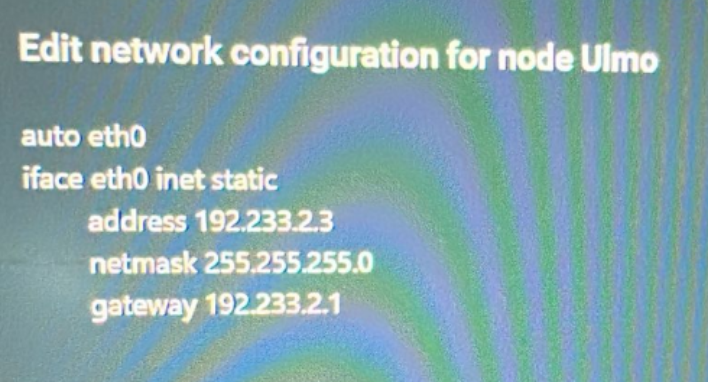
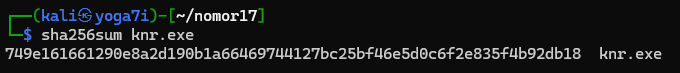
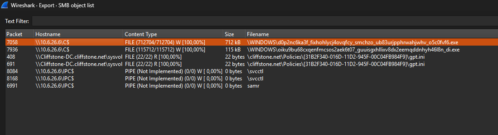
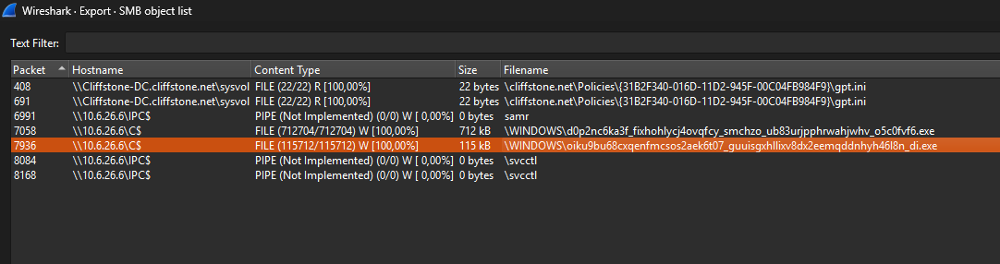

# Jarkom-Modul-01-2025-K44 

| No | Nama                    | NRP       |
|----|-------------------------|-----------|
| 1  | Ahmad Yazid Arifuddin  | 5027241040 |
| 2  | Tiara Fatimah Azzahra  | 5027241090 |

## Nomor 1
ghyUntuk mempersiapkan pembuatan entitas selain mereka, Eru yang berperan sebagai Router membuat dua Switch/Gateway. Dimana Switch 1 akan menuju ke dua Ainur yaitu Melkor dan Manwe. Sedangkan Switch 2 akan menuju ke dua Ainur lainnya yaitu Varda dan Ulmo. Keempat Ainur tersebut diberi perintah oleh Eru untuk menjadi Client.

disini praktikan diminta untuk membuat topologinya 


## Nomor 2
Karena menurut Eru pada saat itu Arda (Bumi) masih terisolasi dengan dunia luar, maka buat agar Eru dapat tersambung ke internet.


Berikut node ERU:


## Nomor 3
Sekarang praktikan harus pastikan setiap Ainur (Client) dapat terhubung satu sama lain.



## Nomor 4
Setelah berhasil terhubung, sekarang Eru ingin agar setiap Ainur (Client) dapat mandiri. Oleh karena itu pastikan agar setiap Client dapat tersambung ke internet.
yang ditandai semua client sukses ping ke 
```
ping -c 5 google.com
```
VARDA (Client)


ULMO (Client)


MELKOR (Client)


MANWE (Client)


## Nomor 5 
Ainur terkuat Melkor tetap berusaha untuk menanamkan kejahatan ke dalam Arda (Bumi). Sebelum terjadi kerusakan, Eru dan para Ainur lainnya meminta agar semua konfigurasi tidak hilang saat semua node di restart.
dimana disini praktikan sudah menguji seluruh konfigurasi (IP, ROUTING, DNS, dll.) 


## Nomor 6
Setelah semua Ainur terhubung ke internet, Melkor mencoba menyusup ke dalam komunikasi antara Manwe dan Eru. Jalankan sebuah file yang bernama traffic lalu lakukan packet sniffing menggunakan Wireshark pada koneksi antara Manwe dan Eru, lalu terapkan display filter untuk menampilkan semua paket yang berasal dari atau menuju ke IP Address Manwe. Simpan hasil capture tersebut sebagai bukti.


## Nomor 14

1. Pertama tama, kita scroll packets hingga akhir dan menemukan jumlah total frame packets nya
```
===== Soal 14 =====
Difficulty: Easy
Note: You can exit anytime by typing 'exit'

How many packets are recorded in the pcapng file?
Format: int
> 500358
```


2. Kemudian ketik filter ```htttp```, dan scroll ke paling akhir untuk mencari akun yang sukses login, karena paling terakhir login maka terakhir yang sukses loginnya
```
What are the user that successfully logged in?
Format: user:pass
> n1enna:y4v4nn4_k3m3nt4r1
```


3. Untuk mencari credentials nya itu pergi ke pojok kanan bawah

```
In which stream were the credentials found?
Format: int
> 41824
```


4. Untuk mencari tools yang digunakan untuk brute force itu ada di ```TCP Follow```, kemudian lihat ```User-Agent: Fuzz Faster U Fool v2.1.0-dev```

```
What tools are used for brute force?
Format: Hydra v1.8.0-dev
> Fuzz Faster U Fool v2.1.0-dev
```


5. Flag is found!
```
KOMJAR25{Brut3_F0rc3_105X4PP8SqxD8VmAsBgaoBbW4}
```

## Nomor 15

1. Untuk mengetahui device yang digunakan adalah dengan melihat table Protocol nya dimana di gambar tertuslis USB

```
What device does Melkor use?
Format: string
> Keyboard
```

2. Kita download dulu menggunakan `wget` & `unzip`. Maka command nya berikut `wget --no-check-certificate 'https://drive.google.com/uc?export=download&id=1PWxEBqlnWzRYx9yv8vI6ZXoYfEJ-fT62' -O hiddenmsg.zip && unzip hiddenmsg.zip`Dengan menggunakan tshark dan tshark mendapatkan angak biner keyboar ```tshark -r hiddenmsg.pcapng -Y usbhid.data -T fields -e usbhid.data | head -n 10``` kemudian di decrypt menggunakan kode python dengan nama file `decrypt.py`   
```
#!/usr/bin/env python3
# decode_hid.py
# Usage: python3 decode_hid.py file.pcapng
# Requires: tshark in PATH

import sys, subprocess, re

if len(sys.argv) < 2:
    print("Usage: python3 decode_hid.py file.pcapng")
    sys.exit(1)

pcap = sys.argv[1]

# try tshark possibilities
candidates = [
    f'tshark -r "{pcap}" -Y usb.capdata -T fields -e usb.capdata',
    f'tshark -r "{pcap}" -Y usbhid.data -T fields -e usbhid.data',
    f'tshark -r "{pcap}" -Y usb.data -T fields -e usb.data'
]
lines = None
for cmd in candidates:
    try:
        p = subprocess.run(cmd, shell=True, check=True, stdout=subprocess.PIPE, stderr=subprocess.PIPE, text=True)
        out = p.stdout.strip()
        if out:
            lines = out.splitlines()
            used_cmd = cmd
            break
    except subprocess.CalledProcessError as e:
        # try next
        continue

if lines is None:
    print("No HID data extracted. Make sure tshark is installed and the pcap contains usb HID traffic.")
    sys.exit(2)

print("Using tshark command:")
print(used_cmd)
print(f"Extracted {len(lines)} report lines.\n")

# HID usage map (partial US keyboard)
hid_map = {
    0x04:'a',0x05:'b',0x06:'c',0x07:'d',0x08:'e',0x09:'f',0x0a:'g',0x0b:'h',0x0c:'i',0x0d:'j',
    0x0e:'k',0x0f:'l',0x10:'m',0x11:'n',0x12:'o',0x13:'p',0x14:'q',0x15:'r',0x16:'s',0x17:'t',
    0x18:'u',0x19:'v',0x1a:'w',0x1b:'x',0x1c:'y',0x1d:'z',
    0x1e:'1',0x1f:'2',0x20:'3',0x21:'4',0x22:'5',0x23:'6',0x24:'7',0x25:'8',0x26:'9',0x27:'0',
    0x28:'\n',0x2c:' ',0x2d:'-',0x2e:'=',0x2f:'[',0x30:']',0x31:'\\',0x33:';',0x34:"'",0x36:',',0x37:'.',0x38:'/'
}

# shift mapping for numbers/symbols
shift_map = {'1':'!','2':'@','3':'#','4':'$','5':'%','6':'^','7':'&','8':'*','9':'(','0':')'}
def decode_report(bytes_list):
    if len(bytes_list) < 3:
        return ''
    mod = bytes_list[0]
    # usage codes typically start at index 2
    chars = []
    for usage in bytes_list[2:]:
        if usage == 0:
            continue
        ch = hid_map.get(usage, '?')
        shift = bool(mod & 0x02 or mod & 0x20)
        if shift and ch.isalpha():
            chars.append(ch.upper())
        elif shift and ch.isdigit():
            chars.append(shift_map.get(ch,ch))
        else:
            chars.append(ch)
    return ''.join(chars)

# parse each line into bytes
reports = []
for line in lines:
    # find all two-digit hex groups
    hexs = re.findall(r'[0-9a-fA-F]{2}', line)
    if not hexs:
        continue
    byte_vals = [int(x,16) for x in hexs]
    reports.append(byte_vals)

# cleaned sequence (remove repeats of same usage tuple)
cleaned = []
last_key = None
for b in reports:
    key = tuple(b[2:]) if len(b) >= 3 else tuple()
    if key == last_key:
        continue
    last_key = key
    cleaned.append(b)

decoded = ''.join(decode_report(b) for b in cleaned)
print("Decoded (cleaned keystrokes):\n")
print(decoded)
```
Kemudian jalankan file python nya `python3 decrypt.py hiddenmsg.pcapng`
kemudian akan didaptkan hasil ```UGx6X3ByMHYxZGVfeTB1cl91czNybjRtZV80bmRfcDRzc3cwcmQ=``` 

```
What did Melkor write?
Format: string
> UGx6X3ByMHYxZGVfeTB1cl91czNybjRtZV80bmRfcDRzc3cwcmQ=
```

3. Lakukan decrypet mengguankan Cyber Chef

```
What is Melkor's secret message?
Format: string
> Plz_pr0v1de_y0ur_us3rn4me_4nd_p4ssw0rd
```

4. The flag is founded
```
KOMJAR25{K3yb0ard_W4rr10r_NKFe6EJaUtn1cZOU3SBGWOv9b}

```


## Nomor 16

1. Untuk memfokuskan pencarian hanya pada perintah login (USER dan PASS) dari attacker untuk log in, melakukan filter dengan command berikut ```ftp.request.command == "USER" or ftp.request.command == "PASS"```. Kemudian akan muncul hasil USER dan PASS di table info


```
What credential did the attacker use to log in?
Format: user:pass
> ind@psg420.com:{6r_6e#TfT1p
```


2. File yang mencurigakan adalah file yang ```executable```  atau ```.exe``` sehingga terdapat 5 files yang mencurigakan berikut atau bisa menggunakan command `ftp.request.command == "SIZE"` kemudian di save as:
 
 


atau bisa menggunakan command `ftp.request.command == "SIZE"`
```
How many files are suspected of containing malware?
Format: int
> 5
```

3. Kemudian pada mode PASV FTP, server mengirimkan tuple (a,b,c,d,p1,p2), a.b.c.d adalah alamat IP dan p1,p2 adalah dua byte port. 

Port TCP/UDP disimpan dalam byte tinggi (p1) dan byte rendah (p2), port dihitung sebagai berikut = p1*256 + p2

contohnya berikut 

p1 = 199 dan p2 = 14. Menghasilkan port `199*256 + 145 = 51.089`

kemudian kita gunakan port itu untuk package yang kita cari dengan filter `tcp.port == 51089` dan ini untuk `q.exe`
```
What is the hash of the first file (q.exe)?
Format: sha256
> ca34b0926cdc3242bbfad1c4a0b42cc2750d90db9a272d92cfb6cb7034d2a3bd
```

4.  `233*256 + 137 = 59785`

Setelah itu decrypt `q.exe`
```
What is the hash of the second file (w.exe)?
Format: sha256
> 08eb941447078ef2c6ad8d91bb2f52256c09657ecd3d5344023edccf7291e9fc
```

5.  `193*256 + 98 = 49506`

decrypt `e.exe`
```
What is the hash of the third file (e.exe)?
Format: sha256
> 32e1b3732cd779af1bf7730d0ec8a7a87a084319f6a0870dc7362a15ddbd3199
```

6. `237*256 + 227 = 60899` 
  

decrypt `r.exe`
```
What is the hash of the fourth file (r.exe)?
Format: sha256
> 4ebd58007ee933a0a8348aee2922904a7110b7fb6a316b1c7fb2c6677e613884
```

7. `195* 256 + 237 = 50157`
  
decrypt `t.exe`
```
What is the hash of the fifth file (t.exe)?
Format: sha256
> 10ce4b79180a2ddd924fdc95951d968191af2ee3b7dfc96dd6a5714dbeae613a
```

8. The Flag is Found!
```
KOMJAR25{Y0u_4r3_4_g00d_4nalyz3r_4oelz1p69nKdUbVRZpwZbMJvg}
```

## Nomor 17
Untuk menggagalkan rencana Melkor, kita perlu menganalisis file capture untuk menemukan file berbahaya yang ia letakkan di web server Manwe. Analisis dilakukan dengan memeriksa file-file yang ditransfer melalui protokol HTTP.


1. Mengekstrak Objek dari Lalu Lintas HTTP. ```File -> Export Objects -> HTTP```. Kemudian terdapat file dengan extension ```.doc```

Fitur ini akan menampilkan daftar lengkap semua objek (gambar, teks, file, dll.) yang ditransfer selama sesi tersebut.
```
What is the name of the first suspicious file?
Format: file.exe
> Invoice&MSO-Request.doc
```

2. kemudian terdapat file extension ```.exe```

```
What is the name of the second suspicious file?
Format: file.exe
> knr.exe
```

3. Kita buat folder `nomor17`
```
mkdir nomor17 && cd nomor17
```
kemudian `wget` file nya dan `unzip`

`wget --no-check-certificate 'https://drive.google.com/uc?export=download&id=1RYDSK7xnMI2i1eMdIsTBz53z7B1lFZqx' -O MelkorPlan2.zip && unzip MelkorPlan2.zip`

Setelah itu `tshark` file nya


```
tshark -r MelkorPlan2.pcap --export-objects http,./
```


 BOOMM!! hasil decrypt nya ditemukan!
```
What is the hash of the second suspicious file (knr.exe)?
Format: sha256
> 749e161661290e8a2d190b1a66469744127bc25bf46e5d0c6f2e835f4b92db18
Congratulations! Here is your flag: KOMJAR25{M4ster_4n4lyzer_4Z5j0iIqGOXPzuEghyWvvxHcY}
```


## Nomor 18
Langkah pertama adalah membuka file capture di Wireshark. Karena metode Melkor kali ini berbeda, kita tidak lagi mencari di HTTP, melainkan di protokol SMB. ```File -> Export Objects -> SMB```. Fitur ini akan menampilkan semua file yang dibagikan atau ditransfer melalui jaringan menggunakan SMB.

1. Terdapat extension file yang mencurigakan dengan dengan extension ```.exe``` sebanyak 2 files

```
How many files are suspected of containing malware?
Format: int
> 2
```

2. Terdapat file mencurigakan dengan extension ```.exe```

```
What is the name of the first malicious file?
Format: file.exe
> d0p2nc6ka3f_fixhohlycj4ovqfcy_smchzo_ub83urjpphrwahjwhv_o5c0fvf6.exe
```

3. Sama seperti nomor 2, terdapat file ```.exe``` lagi dibawahnya

```
Apa nama file berbahaya yang kedua?
Format: file.exe
> oiku9bu68cxqenfmcsos2aek6t07_guuisgxhllixv8dx2eemqddnhyh46l8n_di.exe
```

4. kemudian kita save all dan decrypt file tersebut di wsl kali linux


```
What is the hash of the first malicious file?
Format: sha256
> 59896ae5f3edcb999243c7bfdc0b17eb7fe28f3a66259d797386ea470c010040
```

```
What is the hash of the second malicious file?
Format: sha256
> cf99990bee6c378cbf56239b3cc88276eec348d82740f84e9d5c343751f82560
Congratulations! Here is your flag: KOMJAR25{Y0u_4re_g0dl1ke_1hMBEuCcWC7k6mpKj9MhEZrnq}
```

6. The Flag is Found!
```
KOMJAR25{Y0u_4re_g0dl1ke_1hMBEuCcWC7k6mpKj9MhEZrnq}
```


## Nomor 19

1. Terdapat email ```YourLife36@7162.com```


```
Who sent the threatening message?
Format: string (name)
> Your Life
```

2. Kemudian ditemukan ```1600$```


```
How much ransom did the attacker demand ($)?
Format: int
> 1600
```

3. Kemudian ditemukan juga bitcoin wallet nya


```
What is the attacker's bitcoin wallet?
Format: string
> 1CWHmuF8dHt7HBGx5RKKLgg9QA2GmE3UyL
Congratulations! Here is your flag: KOMJAR25{Y0u_4re_J4rk0m_G0d_ZE7Ukh4pJcJkLSgFsTElr5wV7}
```

4. The Flag is Found!
```
KOMJAR25{Y0u_4re_J4rk0m_G0d_ZE7Ukh4pJcJkLSgFsTElr5wV7}
```


## Nomor 20
1. Karena wireshark biasanya menggunakan TLS maka method encryption nya adalah `TLS`
```
What encryption method is used?
Format: string
> TLS
```

2. Kemudian kita ```wget``` google drive nya `wget --no-check-certificate 'https://drive.google.com/uc?export=download&id=1B3ZUqB1QruobkT59y3BTOwX0V5lV4lkA' -O MelkorPlan5.zip && unzip MelkorPlan5.zip`

selanjutnya ```unzip``` foldernya

kemudian `tshark`
```
tshark -r MelkorPlan5.pcap -q -o tls.keylog_file:keyslogfile.txt --export-objects http,./
```
kemudian `ls` dan akan muncul berikut
```
┌──(kali㉿yoga7i)-[~/20]
└─$ ls
 1.0
'1(1).0'
'1(2).0'
'1(3).0'
'1(4).0'
'1(5).0'
'CC%3f&Clientid=%7bD61AB268-C26A-439D-BB15.20194&Audience=Production&Build=ship&Architecture=x64&Language=en-US&SubscriptionLicense=false&PerpetualLicense=2019&Channel=CC&InstallType=C2R&SessionId=%7b004BB289-F613-4DD4-8968-6CBD7BE8B7AB%7d&LabMachine=false'
'docs(1).php'
'docs(2).php'
'docs(3).php'
'docs(4).php'
 docs.php
 invest_20.dll
 keyslogfile.txt
 MelkorPlan5.pcap
 MelkorPlan5.zip
```
karena hasilnya `.php` `.0` `.dll`, kita coba yang extension `.dll` kemudian BOOMM!! successss......
```
What is the name of the malicious file placed by the attacker?
Format: file.exe
>  invest_20.dll
```

3. Decrypt dengan `sha256sum`


```
What is the hash of the file containing the malware?
Format: sha256
> 31cf42b2a7c5c558f44cfc67684cc344c17d4946d3a1e0b2cecb8eb58173cb2f
Congratulations! Here is your flag: KOMJAR25{B3ware_0f_M4lw4re_cwcD4U64nPPHru1lqR222zb3a}
```

4. The flag is found!
```
KOMJAR25{B3ware_0f_M4lw4re_cwcD4U64nPPHru1lqR222zb3a}
```

