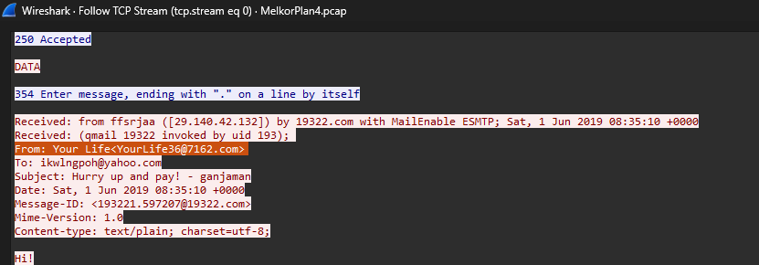

# Jarkom-Modul-01-2025-K44 

| No | Nama                    | NRP       |
|----|-------------------------|-----------|
| 1  | Ahmad Yazid Arifuddin  | 5027241040 |
| 2  | Tiara Fatimah Azzahra  | 5027241090 |

## Nomor 1
ghyUntuk mempersiapkan pembuatan entitas selain mereka, Eru yang berperan sebagai Router membuat dua Switch/Gateway. Dimana Switch 1 akan menuju ke dua Ainur yaitu Melkor dan Manwe. Sedangkan Switch 2 akan menuju ke dua Ainur lainnya yaitu Varda dan Ulmo. Keempat Ainur tersebut diberi perintah oleh Eru untuk menjadi Client.

disini praktikan diminta untuk mebuat topologinya 
)


## Nomor 2
Karena menurut Eru pada saat itu Arda (Bumi) masih terisolasi dengan dunia luar, maka buat agar Eru dapat tersambung ke internet.

## Nomor 14

1. Pertama tama, kita scroll packets hingga akhir dan menemukan jumlah total frame packets nya
```
===== Soal 14 =====
Difficulty: Easy
Note: You can exit anytime by typing 'exit'

How many packets are recorded in the pcapng file?
Format: int
> 500358
```


2. Kemudian ketik filter ```htttp```, dan scroll ke paling akhir untuk mencari akun yang sukses login, karena paling terakhir login maka terakhir yang sukses loginnya
```
What are the user that successfully logged in?
Format: user:pass
> n1enna:y4v4nn4_k3m3nt4r1
```


3. Untuk mencari credentials nya itu pergi ke pojok kanan bawah

```
In which stream were the credentials found?
Format: int
> 41824
```


4. Untuk mencari tools yang digunakan untuk brute force itu ada di ```TCP Follow```, kemudian lihat ```User-Agent: Fuzz Faster U Fool v2.1.0-dev```

```
What tools are used for brute force?
Format: Hydra v1.8.0-dev
> Fuzz Faster U Fool v2.1.0-dev
```


5. Flag is found!
```
KOMJAR25{Brut3_F0rc3_105X4PP8SqxD8VmAsBgaoBbW4}
```

## Nomor 15

## Nomor 16

1. Untuk memfokuskan pencarian hanya pada perintah login (USER dan PASS) dari attacker untuk log in, melakukan filter dengan command berikut ```ftp.request.command == "USER" or ftp.request.command == "PASS"```. Kemudian akan muncul hasil USER dan PASS di table info


```
What credential did the attacker use to log in?
Format: user:pass
> ind@psg420.com:{6r_6e#TfT1p
```


2. File yang mencurigakan adalah file yang ```executable```  atau ```.exe``` sehingga terdapat 5 files yang mencurigakan berikut : 
 


```
How many files are suspected of containing malware?
Format: int
> 5
```

3. 
```
What is the hash of the first file (q.exe)?
Format: sha256
> ca34b0926cdc3242bbfad1c4a0b42cc2750d90db9a272d92cfb6cb7034d2a3bd
```

4. 
```
What is the hash of the second file (w.exe)?
Format: sha256
> 08eb941447078ef2c6ad8d91bb2f52256c09657ecd3d5344023edccf7291e9fc
```

5.
```
What is the hash of the third file (e.exe)?
Format: sha256
> 32e1b3732cd779af1bf7730d0ec8a7a87a084319f6a0870dc7362a15ddbd3199
```

6. 
```
What is the hash of the fourth file (r.exe)?
Format: sha256
> 4ebd58007ee933a0a8348aee2922904a7110b7fb6a316b1c7fb2c6677e613884
```

7. 
```
What is the hash of the fifth file (t.exe)?
Format: sha256
> 10ce4b79180a2ddd924fdc95951d968191af2ee3b7dfc96dd6a5714dbeae613a
```

8. The Flag is Found!
```
KOMJAR25{Y0u_4r3_4_g00d_4nalyz3r_4oelz1p69nKdUbVRZpwZbMJvg}
```

## Nomor 17
Untuk menggagalkan rencana Melkor, kita perlu menganalisis file capture untuk menemukan file berbahaya yang ia letakkan di web server Manwe. Analisis dilakukan dengan memeriksa file-file yang ditransfer melalui protokol HTTP.


1. Mengekstrak Objek dari Lalu Lintas HTTP. ```File -> Export Objects -> HTTP```. Kemudian terdapat file dengan extension ```.doc```

Fitur ini akan menampilkan daftar lengkap semua objek (gambar, teks, file, dll.) yang ditransfer selama sesi tersebut.
```
What is the name of the first suspicious file?
Format: file.exe
> Invoice&MSO-Request.doc
```

2. kemudian terdapat file extension ```.exe```

```
What is the name of the second suspicious file?
Format: file.exe
> knr.exe
```

3. 
```
What is the hash of the second suspicious file (knr.exe)?
Format: sha256
> 749e161661290e8a2d190b1a66469744127bc25bf46e5d0c6f2e835f4b92db18
Congratulations! Here is your flag: KOMJAR25{M4ster_4n4lyzer_4Z5j0iIqGOXPzuEghyWvvxHcY}
```


## Nomor 18
Langkah pertama adalah membuka file capture di Wireshark. Karena metode Melkor kali ini berbeda, kita tidak lagi mencari di HTTP, melainkan di protokol SMB. ```File -> Export Objects -> SMB```. Fitur ini akan menampilkan semua file yang dibagikan atau ditransfer melalui jaringan menggunakan SMB.

1. Terdapat extension file yang mencurigakan dengan dengan extension ```.exe``` sebanyak 2 files

```
How many files are suspected of containing malware?
Format: int
> 2
```

2. Terdapat file mencurigakan dengan extension ```.exe```

```
What is the name of the first malicious file?
Format: file.exe
> d0p2nc6ka3f_fixhohlycj4ovqfcy_smchzo_ub83urjpphrwahjwhv_o5c0fvf6.exe
```

3. Sama seperti nomor 2, terdapat file ```.exe``` lagi dibawahnya

```
Apa nama file berbahaya yang kedua?
Format: file.exe
> oiku9bu68cxqenfmcsos2aek6t07_guuisgxhllixv8dx2eemqddnhyh46l8n_di.exe
```

4. 
```
What is the hash of the first malicious file?
Format: sha256
> 59896ae5f3edcb999243c7bfdc0b17eb7fe28f3a66259d797386ea470c010040
```

5. 
```
What is the hash of the second malicious file?
Format: sha256
> cf99990bee6c378cbf56239b3cc88276eec348d82740f84e9d5c343751f82560
Congratulations! Here is your flag: KOMJAR25{Y0u_4re_g0dl1ke_1hMBEuCcWC7k6mpKj9MhEZrnq}
```

6. The Flag is Found!
```
KOMJAR25{Y0u_4re_g0dl1ke_1hMBEuCcWC7k6mpKj9MhEZrnq}
```


## Nomor 19

1. Terdapat email ```YourLife36@7162.com```


```
Who sent the threatening message?
Format: string (name)
> Your Life
```

2. Kemudian ditemukan ```1600$```


```
How much ransom did the attacker demand ($)?
Format: int
> 1600
```

3. Kemudian ditemukan juga bitcoin wallet nya


```
What is the attacker's bitcoin wallet?
Format: string
> 1CWHmuF8dHt7HBGx5RKKLgg9QA2GmE3UyL
Congratulations! Here is your flag: KOMJAR25{Y0u_4re_J4rk0m_G0d_ZE7Ukh4pJcJkLSgFsTElr5wV7}
```

4. The Flag is Found!
```
KOMJAR25{Y0u_4re_J4rk0m_G0d_ZE7Ukh4pJcJkLSgFsTElr5wV7}
```


## Nomor 20
1. 
```
What encryption method is used?
Format: string
> TLS
```

2. 
```
What is the name of the malicious file placed by the attacker?
Format: file.exe
>  invest_20.dll
```

3. 
```
What is the hash of the file containing the malware?
Format: sha256
> 31cf42b2a7c5c558f44cfc67684cc344c17d4946d3a1e0b2cecb8eb58173cb2f
Congratulations! Here is your flag: KOMJAR25{B3ware_0f_M4lw4re_cwcD4U64nPPHru1lqR222zb3a}
```

4. The flag is found!
```
KOMJAR25{B3ware_0f_M4lw4re_cwcD4U64nPPHru1lqR222zb3a}
```

